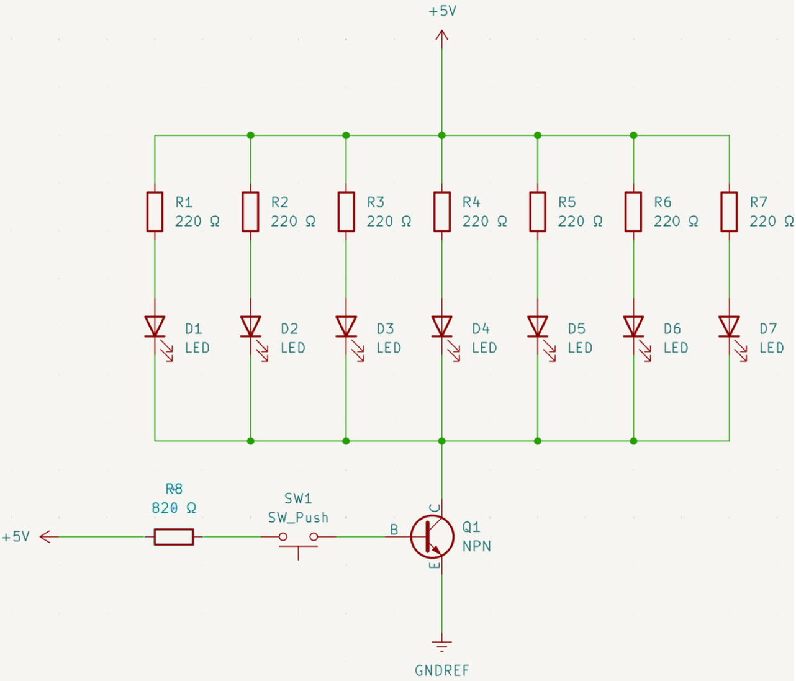

# BJT as a Solid-State Switch

A 2N2222 NPN transistor switching seven parallel LEDs from a single push button.

**Course:** RBT125 Lab 6.1 · **Tools:** KiCad, breadboard, 2N2222

**Demo:** [Watch on YouTube](https://youtu.be/o3nAJ7aqdOg) · **Circuit:** [View simulation on Tinkercad](https://www.tinkercad.com/things/6emQMBrnIHh-bjt-transistor-switchdgarcia?sharecode=Z3i7xH6yJULmU_QULNfHRy5jOEcF_sYCTGpOZ0t8cJw)

## Degree Objective

**Objective 2 — Demonstrate embedded microprocessor system and circuit skills.**

**How it meets the objective:** It demonstrates circuit skills at the component level — calculating the transistor's base resistor from gain (HFE) and load current so one button reliably switches seven parallel LEDs, the same load-switching principle microcontrollers depend on to drive motors and pumps.

## What I Did

Built the switching circuit with seven blue LEDs in parallel on the collector side and a push button feeding the base through a current-limiting resistor. Calculated the base resistor from the transistor's HFE and the total collector-emitter current needed to saturate the switch, distinguishing it from the separate 220 Ω LED protection resistor. Documented the schematic in KiCad and verified on/off behavior on the breadboard.

## Schematic

## Files

- `bjt-transistor-switch_schematic.png` — KiCad schematic

## Links

- Demo video: https://youtu.be/o3nAJ7aqdOg
- Tinkercad simulation: [BJT Transistor Switch](https://www.tinkercad.com/things/6emQMBrnIHh-bjt-transistor-switchdgarcia?sharecode=Z3i7xH6yJULmU_QULNfHRy5jOEcF_sYCTGpOZ0t8cJw)
- Portfolio: https://www.garciarobotics.com/
